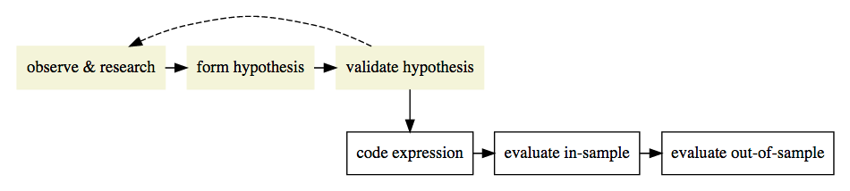
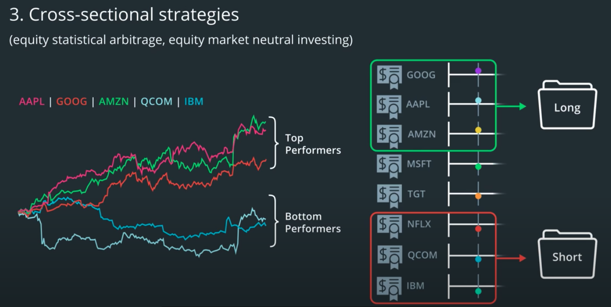
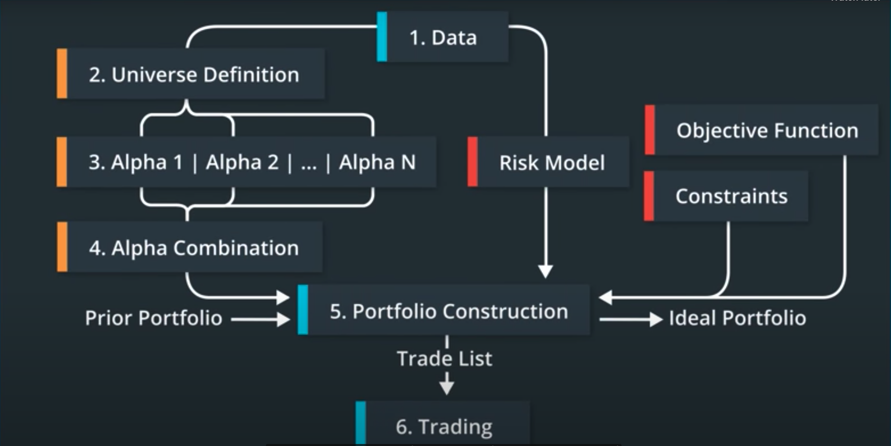

# Momentum Strategy Research

I wanted to work on this project to dive deeper into financial trading using algorithms and code to handle the research, backtesting, and buy/sell signals used in typical financial firms. This project focuses on the research aspect of the algorithmic trading process. With the rise in using computers, machine learning and big data to find tradable signals to beat the market (alpha signals) I wanted to understand how existing firms perform research to build a better intuition for applying machine learning to create new algorithms built on top of current methods. This project is a personal project to build understanding through research and application of the skills used in practice and is not intended as financial or investment advice.

## Project Background & Observation
To combat the 2020 novel coronavirus (Covid-19) outbreak within the United States, many city and state officials issued 4-6 week stay-at-home orders that started in March and ended between the end of April to the beginning of May. These stay-at-home orders caused an abrupt fall in demand for oil and an increase in the use of online platforms to conduct work remotely. The drop in demand for oil created a rise in the supply, which quickly lead to a shortage of space to store the excess oil causing prices to decrease into negative territory. This was preceded by lock-downs around the world where the virus was present and rapidly spreading. China's lockdown and subsequent drop in demand in particular triggered a price war between Saudi Arabia and Russia in early March due to both countries' refusal to cut crude oil production. On the other hand, large tech stocks continued to rise to historic all time highs as people shifted to remote work, utilizing web-conferencing and cloud computing technologies. For example, Apple's valuation was around $1 Trillion before the stay-at-home orders were put in place in March. After a sharp and rapid decline with the rest of the market, Apple's stock price quickly bounced back and increased to a new all-time-high and continued into new price discovery territory for months. Apple eventually stabilized around a $2 Trillion valuation, doubling its value in less than a year. Many of the other large technology companies saw similar patterns during this time period. The novel coronavirus has been a true "black swan" event with its abrupt effects causing major shifts in the demand and supply curves for many industries in 2020.

I was curious about whether these extreme shifts and following trends in demand and supply between the technology stocks and the oil and gas stocks would provide a statistically significant alpha signal. I used this project to test this curiosity using a cross-sectional momentum strategy.

### Financial Research Process

The financial research process is a multi-step process that seeks to find a signal that is statistically significant to trade. This project focuses on the first three steps in the image below: observe & research, form hypothesis, validate hypothesis.

Alpha Research Process *(Source: Udacity, AI for Trading)*

It would be helpful to define some terms at this point.

[**Alpha**](https://www.investopedia.com/terms/a/alpha.asp)

Alpha is a term used to describe a strategy's ability to generate returns greater than the market returns. For example, if the S&P500 increased 5% in a particular year, a successful strategy that achieved "alpha" may have returned 10% in the same year. Alpha strategies are usually mentioned in conjunction with beta strategies, which passively track the market. The use of alpha strategies is generally called *active* trading/management, while the use of beta strategies is generally referred to as *passive* trading/management.

> Alpha (α) is a term used in investing to describe an investment strategy's ability to beat the market, or it's "edge." *(Source: [Investopedia](https://www.investopedia.com/terms/a/alpha.asp))*

> An alpha is a combination of mathematical expressions, computer source code, and
configuration parameters that can be used, in combination with historical data, to make
predictions about future movements of various financial instruments. *(Source: [Finding Alphas by Igor Tulchinsky](https://www.amazon.com/dp/B014SX8LX2/ref=dp-kindle-redirect?_encoding=UTF8&btkr=1))*

[**Systematic Trading**](https://en.wikipedia.org/wiki/Systematic_trading)

Systematic trading refers to the use of strategies, plans, and rules to guide a trader's approach and decisions while trading in the markets. Systematic trading strategies can be manual, hybrid manual/automated, or fully automated through the use of computers, algorithms, and code. This style of trading helps decrease or eliminate the consequences of emotional trading from fear or greed that could influence a trader's decisions.

> Systematic trading (also known as mechanical trading) is a way of defining trade goals, risk controls and rules that can make investment and trading decisions in a methodical way. *(Source: Wikipedia)*

> The use of computers to model, test and implement mathematical rules for how to trade. *(Source: [Clenow, Andreas. Trading Evolved](https://www.amazon.com/Trading-Evolved-Anyone-Killer-Strategies/dp/109198378X))*

[**Momentum**](https://www.investopedia.com/terms/m/momentum.asp)

Momentum is fundamentally based on Newton's first law, the law of inertia, that states an object at rest or in motion will remain at rest or in motion until acted upon by a force. Momentum as applied to the markets refers to trend following, where a stock that is moving up or down on a trend will continue to move in the same direction until something acts upon that trend to reverse it. This trend following phenomenon is the main assumption behind momentum based strategies. It is the idea that outperforming stocks tend to keep moving upward over time while underperforming stocks tend to keep moving downward over time. I have included a couple of passages from Andreas Clenow's book, Trading Evolved, to describe momentum in respect to markets further.

> Momentum is the principle that stocks that moved up strongly in the recent past are a little more likely to do better than other stocks in the near future. *(Source: [Clenow, Andreas. Trading Evolved](https://www.amazon.com/Trading-Evolved-Anyone-Killer-Strategies/dp/109198378X))*

> Momentum is a market phenomenon that has been working well for decades. It has been confirmed by academics and practitioners and is universally known as a valid approach to the financial markets. *(Source: [Clenow, Andreas. Trading Evolved](https://www.amazon.com/Trading-Evolved-Anyone-Killer-Strategies/dp/109198378X))*

[**Stock Universe**](https://www.investopedia.com/terms/u/universeofsecurities.asp#:~:text=A%20universe%20of%20securities%20generally,parameters%20for%20a%20managed%20fund.)

A stock or securities universe refers to a group of stocks that share a common feature or features.

> A universe of securities generally refers to a set of securities that share a common feature. *(Source: Investopedia)*

> Stock universe is a general term in finance that refers to a group of stocks that share certain common features, belong to the same market or a set of stocks that are used in verifying or simulating trading strategies. *(Source: Udacity, AI for Trading)*

### Cross-Sectional Momentum Strategy

For this project I used a cross-sectional momentum strategy. This is a strategy where a trader invests in multiple stocks at the same time by ranking the stocks within a universe using historical data to calculate previous returns, then putting the best performers in a long portfolio and the worst performers in a short portfolio. For this specific project, I kind of did this already by putting tech stocks in the long portfolio and oil & gas stocks in the short portfolio. If I were to do this in practice, I would probably use an entire sector for my universe, such as technology, and then filter through all the stocks to get the n best and worst performers to add to my stock portfolios. This is where my implementation of this strategy deviates from the traditional approach. For an example of the traditional cross-sectional momentum strategy check out the cross_sec_momentum_strategy.py script. For this project I will be discussing the results from the cross_sec_momentum_strategy_separated.py script, which ranks the stocks within each portfolio (long and short) and then picks the best performers within the long portfolio and the worst performers in the short portfolio. This deviation was because I wanted to keep my data collection and stock universe small so I could spend more time learning the strategy.

Here is a diagram that shows identification of top and bottom performers within a stock universe and then selecting three stocks to put into the long and short portfolios. The stock tikers are the universe, the plots of the closing prices shows the top and bottom performers. The list to the right shows the rank order of the stock returns. The folders represent the long and short portfolios and which stocks were put into each portfolio.

Cross-sectional Strategy *(Source: Udacity, AI for Trading)*

**Cross-sectional Strategy Steps:**
1. Choose a stock universe and get data (used daily data)
2. Re-sample prices for the desired investment interval, extract interval-end prices, compute log returns (used monthly)
3. Rank by interval-end returns, select top and bottom n stocks - put top performers in long portfolio and worst performers in short portfolio
4. Compute long and short portfolio returns (used arithmetic mean because I assumed each investment would get equal amount)
5. Combine portfolio returns
6. Continue to do this for the selected investment interval (trading)

For a breakdown of the anatomy of a cross-sectional momentum strategy see below. Each number generally corresponds to the numbers in the steps above.

Cross-sectional Strategy *(Source: Udacity, AI for Trading)*

## Project Details

### Purpose

### Stock Universe & Data

### Trading Strategy

### Research

### Results

## Further Work
- Query an API, such as Yahoo Finance, to create a dynamic filter for the long and short portfolios.
- Filter the top 10 best performing and worst performing equities into a long portfolio and a short portfolio dynamically.
- Apply a coefficient to discriminate between stocks that follow a more stable trend to stocks that are more volatile (i.e. apply R2 from a linear regression).
- Refactor code into a class to make it more usable in a repeatable way.

## Sources
